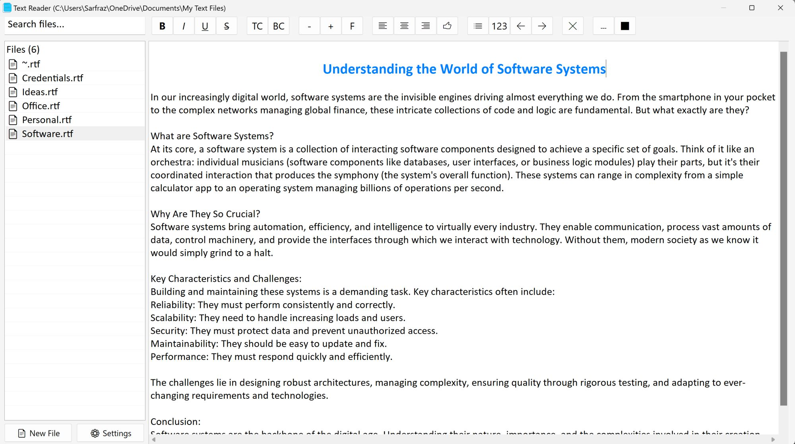

# TextReader

TextReader is a lightweight and customizable rich text reader application built using AutoHotkey. It provides a user-friendly interface for viewing and interacting with rich text files saved in specific folder. This app loads all rich text files from specified folder.

I built this app for personal needs as my desktop was becoming a mess due to various text files. No more text files and mess on my desktop!

## Screenshots



## Features

*   **Rich Text Display:** Supports displaying text with various formatting options.
*   **File Management:** Open and manage text files easily.
*   **Text Search:** Efficiently search for specific text within open documents.
*   **Customizable Settings:** Configure application behavior and appearance through settings.
*   **Intuitive GUI:** A clean and functional graphical user interface.

## How to Use

1.  **Run the Executable:** If you have the `TextReader.exe` file, simply double-click it to launch the application.
2.  **Run from Source:** If you have AutoHotkey installed, you can run `TextReader.ahk` directly.

    ```bash
    autohotkey TextReader.ahk
    ```

Once launched, you can open text files through the application's interface and utilize its features.

## Requirements

*   [AutoHotkey](https://www.autohotkey.com/) (if running from source)

## Installation

1.  **Clone the Repository:**
    ```bash
    git clone https://github.com/your-username/TextReader.git
    cd TextReader
    ```
2.  **Download Executable (Optional):** If an executable is provided, you can simply download and run it.

## Contributing

Contributions are welcome! Please feel free to fork the repository, make your changes, and submit a pull request.

## License

This project is open-source and available under the [MIT License](LICENSE).
